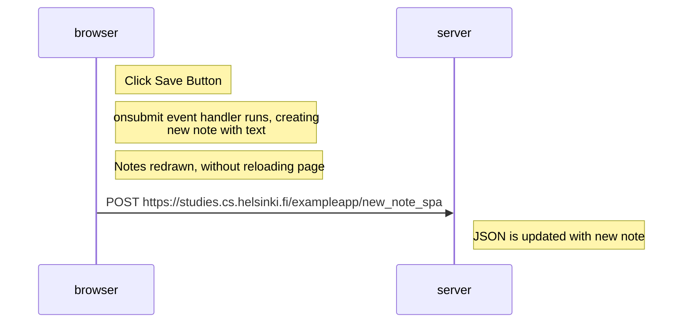

# New note in Single Page App diagram

```mermaid
sequenceDiagram
  participant browser
  participant server

  Note right of browser: Click Save Button

  Note right of browser: onsubmit event handler runs, creating <br/> new note with text
  Note right of browser: Notes redrawn, without reloading page

  browser->>server: POST https://studies.cs.helsinki.fi/exampleapp/new_note_spa

  Note right of server: JSON is updated with new note
```
