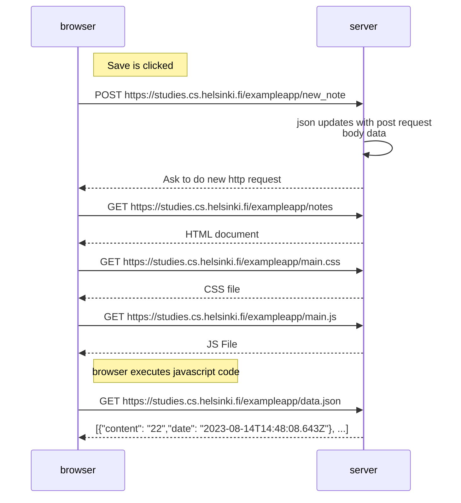

# New Note Diagram

```mermaid
sequenceDiagram
  participant browser
  participant server

  Note right of browser: Save is clicked
  browser->>server: POST https://studies.cs.helsinki.fi/exampleapp/new_note
  server->>server: json updates with post request<br/> body data
  server-->>browser: Ask to do new http request
  browser->>server: GET https://studies.cs.helsinki.fi/exampleapp/notes
  server-->>browser: HTML document
  browser->>server: GET https://studies.cs.helsinki.fi/exampleapp/main.css
  server-->>browser: CSS file
  browser->>server: GET https://studies.cs.helsinki.fi/exampleapp/main.js
  server-->>browser: JS File
  Note right of browser: browser executes javascript code
  browser->>server: GET https://studies.cs.helsinki.fi/exampleapp/data.json
  server-->>browser: [{"content": "22","date": "2023-08-14T14:48:08.643Z"}, ...]
  

```
