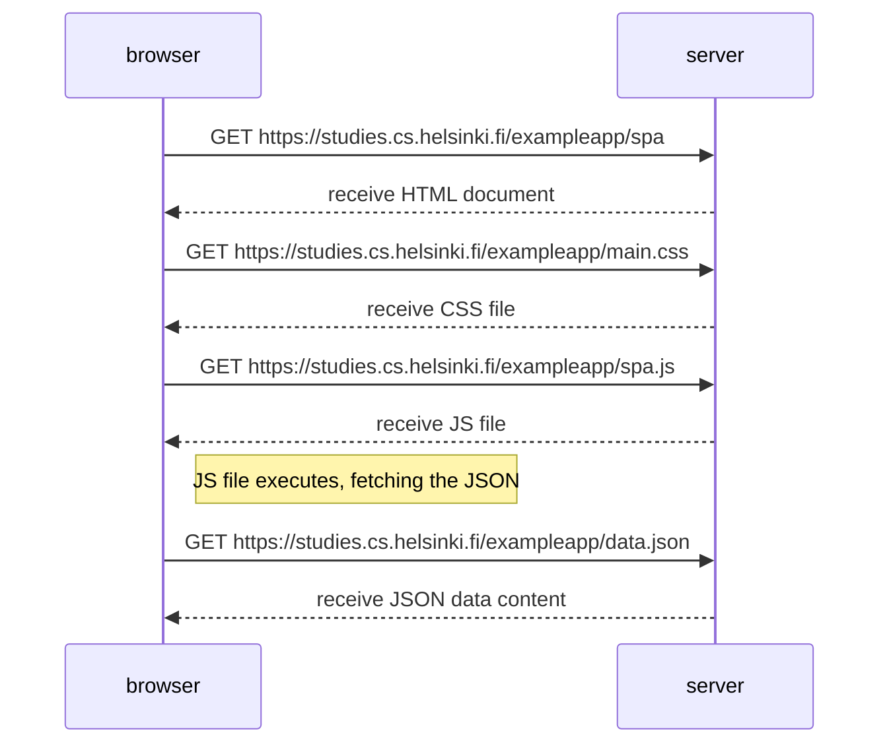

# Single Page App Diagram

```mermaid

sequenceDiagram
  participant browser
  participant server

  browser->>server: GET https://studies.cs.helsinki.fi/exampleapp/spa
  server-->>browser: receive HTML document

  browser->>server: GET https://studies.cs.helsinki.fi/exampleapp/main.css
  server-->>browser: receive CSS file

  browser->>server: GET https://studies.cs.helsinki.fi/exampleapp/spa.js
  server-->>browser: receive JS file

  Note right of browser: JS file executes, fetching the JSON

  browser->>server: GET https://studies.cs.helsinki.fi/exampleapp/data.json
  server-->>browser: receive JSON data content

```
